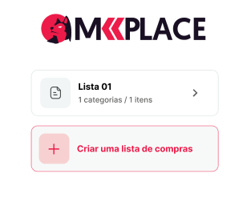
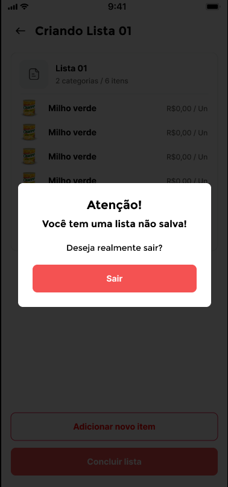
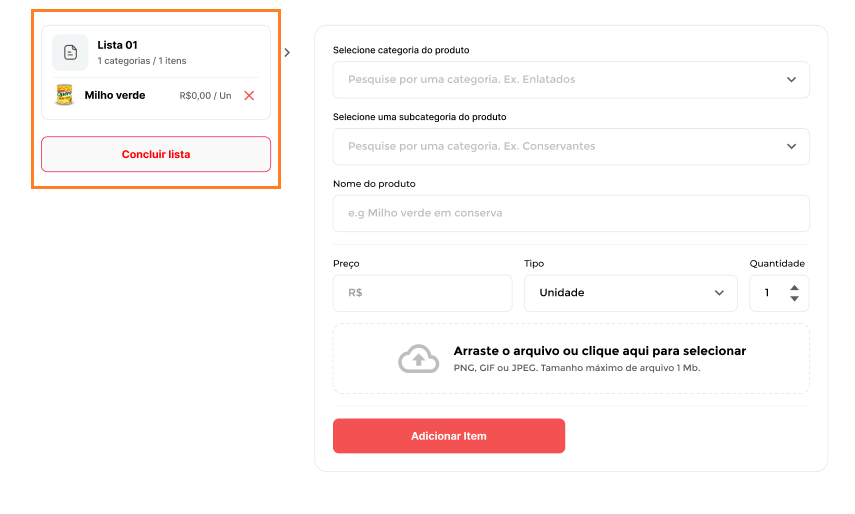

# Teste técnico para Frontend Developer MKPlace

Neste repositório você encontra o teste técnico utilizado para as nossas vagas de Desenvolvedor(a) Frontend.

Esta avaliação é aplicada para as vagas em todos os níveis - júnior a sênior - mudando os critérios de análise.
Se você for júnior e não conseguir completar o teste, não tem problema. Gostaríamos de avaliar até onde você conseguiu chegar e a lógica que aplicou, porém é necessário ter criado pelo menos as páginas estáticas para mobile e desktop.

## Instruções

Para realizar este teste, você deverá clicar em **use this template**, criar seu repositório com o nome **teste-tecnico-mkplace** e começar a desenvolver.

O protótipo do projeto, bem como os assets, podem ser encontrados neste link: https://www.figma.com/file/neYyxwxoy3mzqjHXJjfif6/Teste-T%C3%A9cnico-Frontend?node-id=51%3A318

A documentação da API pode ser encontrada neste link: [Api Documentation](api-documentation.md)

Para rodar a aplicação no NextJs, você deverá realizar a instalação dos pacotes com o comando "yarn" ou "npm install" - de acordo com sua preferência - e em seguida iniciá-la com "yarn dev" ou "npm run dev".
Alguns scripts de comando podem ser encontrados no arquivo _package.json_.

Nós concordamos que este teste pode ser resolvido em cerca de 20h, porém o prazo limite estipulado para entrega é de até 10 dias. O mais importante é avaliar se você conseguiu alcançar os objetivos que foram propostos.

## Desafio

Você deverá desenvolver uma aplicação para criar e visualizar listas de compras, contendo as informações básicas e imagens dos produtos selecionados.

## Descrição geral

- Ao abrir a tela, o usuário deverá encontrar um botão para adicionar uma lista de compras.
  Caso já exista alguma lista criada, a mesma deverá aparecer na tela, constando informações de título, quantidade de categorias e quantidade de itens.

  

- Ao clicar em **criar uma lista de compras**, o usuário deverá encontrar um formulário de cadastro, contendo os campos:

  - Selecionar uma categoria - traz um select input onde o usuário pode visualizar as categorias existentes e selecionar uma.
  - Selecionar uma sub-categoria - traz um select input onde o usuário pode visualizar as sub-categorias existentes e selecionar uma. _Habilitado apenas se a categoria estiver selecionada_.
  - Nome do produto - input com _autocomplete_. O usuário deve digitar o nome do produto e o input deverá trazer sugestões para o que está sendo escrito.
  - Preço - traz um input onde o usuário deve poder inserir valor do produto.
  - Tipo - traz um select input onde o usuário pode visualizar as unidades de medida ( unidade ou Kg ) do produto e selecionar uma.
  - Quantidade - traz um input onde o usuário deve poder inserir a quantidade de itens que quer adicionar.
  - Campo para upload de imagens - traz um input de _file upload_, onde o usuário poderá inserir uma imagem do produto. _A imagem deverá ter no máximo 1MB_.
  - Botão de submit - o usuário poderá adicionar o item criado.

  _Observação: no mobile, se o usuário estiver na página de criação da lista e clicar em voltar sem ter selecionado a opção de **concluir lista**, um modal deverá ser aberto para que o mesmo confirme a ação._

  

  <a id="citacao_item_criado"> Assim que o item for adicionado, este deverá ser listado ao lado esquerdo do formulário - abaixo do card descritivo com título, quantidade de categorias e quantidade de itens existentes - apresentando os detalhes de imagem (se existir), nome, preço e tipo de unidade de medida para o mesmo, bem como o botão de _delete_ alinhado ao lado direito do card. </a>

  

- Ao clicar em **concluir lista**, o usuário deverá voltar para a página inicial, onde irá observar as listas criadas. Ao entrar em uma lista, deverá visualizar:
  - Lista dos itens criados, separados de acordo com a categoria.
  - Cada item deverá conter um input do tipo _checkbox_, onde o usuário poderá marcar o item que já adquiriu.
  - Cada item deverá conter um seletor de quantidade, onde o usuário poderá visualizar a quantidade criada e altera-lá, se assim preferir.
  - Cada item deverá conter o valor total para aquele item, de acordo com a quantidade selecionada pelo usuário.
  - Valor total do carrinho, que deverá ser atualizado a cada mudança nas quantidades dos itens na lista.

### Requisições API a serem realizadas em cada etapa

- Página inicial:

  - Deverá trazer a relação de todas as listas de compras já criadas pelo usuário, utilizando a rota [**[GET] /api/list**](api-documentation.md#get_list).

- Página do formulário de criação do item:

  - Select input de categorias: utilizar a rota [**[GET] /api/category**](api-documentation.md#category), para trazer as opções de categoria existentes.
  - Select input de sub-categorias: utilizar a rota [**[GET] /api/subcategory**](api-documentation.md#subcategory), para trazer as opções de sub-categorias existentes.
  - Input com opção autocomplete: utilizar a rota <a href="api-documentation.md#products">**[GET] /api/products**</a>, para trazer opções de nomes de produtos para o usuário inserir no campo.
  - Campo para upload: utilizar a rota [**[POST] /api/upload**](api-documentation.md#upload), para fazer o envio de imagens.
  - Botão de concluir lista: fazer o upload das imagens de cada produto, usando o endpoint do upload e atrelar a URL de resposta ao objeto do produto, em sequência utilizar a rota [**[POST] /api/list**](api-documentation.md#post_list) para fazer o envio das informações e criar a lista.

  _Observação: assim que o primeiro item estiver criado, este deverá ser listado na tela, como já citado na seção [**Descrição geral**](#citacao_item_criado), utilizando a rota [**[GET] /api/list**](api-documentation.md#get_list) para trazer as informações._

- Página de lista de compras:
  - Verificar se existe alguma lista salva no estado global e, caso não exista, utilizar a rota de [**[GET] /api/list**](api-documentation.md#get_list) para trazer todas as listas, filtrando-as pelo id informado na URL.

## Requisitos técnicos para o teste

- O projeto utiliza o React Js como biblioteca para construção das interfaces e Next Js como framework.
- Para o gerenciamento de estados globais você deverá utilizar Context API.
- O uso de Typescript é obrigatório.
- Deixamos a definição e metodologia do CSS a ser utilizada a seu critério, mas por aqui utilizamos o Tailwind como framework.

## Critérios de avaliação

- Arquitetura utilizada.
- Organização do código - legibilidade, usabilidade e manutenibilidade.
- Componentização de código.
- Clean code.
- Histórico de commits.
- Layout responsivo - de acordo com o mockup para mobile.
- Alcance dos objetivos que foram propostos.

## O que seria um diferencial

- Renderizar a página de detalhamento da lista de compras com SSR, visando o SEO.
- Utilização de teste.
- Small commits.
- Ver seu código hospedado na Vercel.

## Submissão do teste

O link do seu repositório deverá ser enviado ao seguinte e-mail:

- amanda.tavares@mkplace.com.br

Em caso de dúvidas, entrar em contato com Amanda Tavares.
